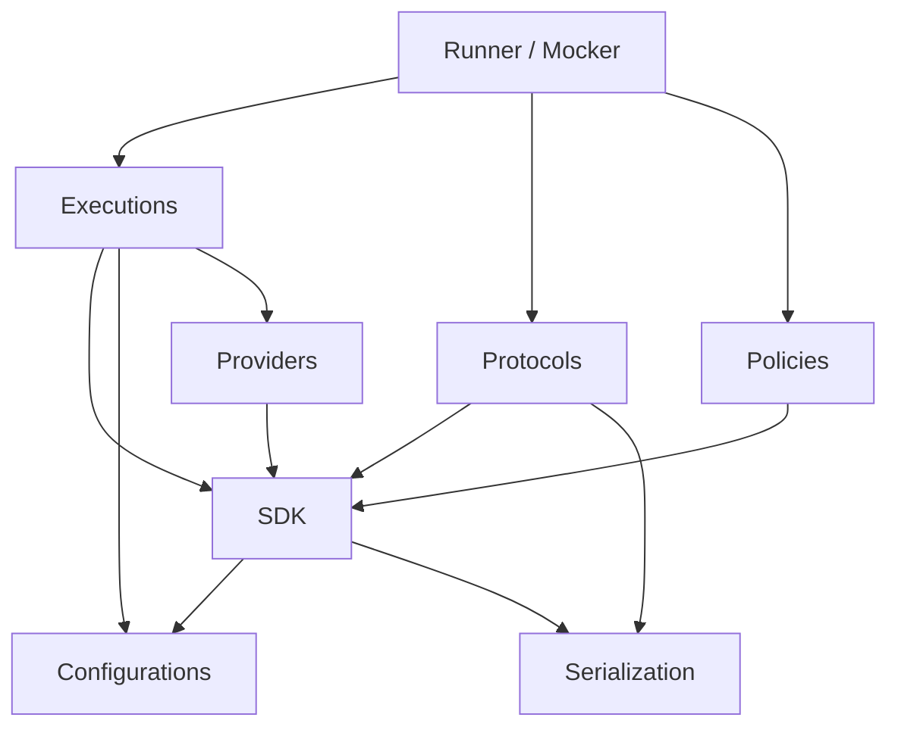

# QaaS Framework

The **QaaS.Framework** is the shared foundation that both [Runner](../qaas/index.md) and [Mocker](../mocker/index.md) are built on. It is a set of 8 NuGet packages targeting **.NET 10**, each with a focused responsibility.

| | |
|---|---|
| **Runtime** | .NET 10 |
| **Source** | [Repository — QaaS.Framework]({{ links.repository_framework }}) |
| **Author** | SmokeTeam |

## Package Map

## Projects

| Package | Purpose | Key Types |
|---|---|---|
| [**SDK**](./projects/sdk.md) | Shared data structures and hook base classes | `IHook`, `BaseAssertion`, `BaseGenerator`, `BaseProbe`, `IProcessor`, `Context`, `Data`, `SessionData` |
| [**Configurations**](./projects/configuration.md) | YAML loading, placeholder resolution, validation | `ConfigurationUtils`, `PlaceholderConfigurationBuilderExtension`, 18 custom validation attributes |
| [**Executions**](./projects/executions.md) | Execution lifecycle and CLI scaffolding | `IRunner`, `BaseExecution`, `BaseLoader`, `ParserBuilder` |
| [**Infrastructure**](./projects/infrastructure.md) | Cross-cutting utilities | `DateTimeExtensions`, `FileSystemExtensions` |
| [**Policies**](./projects/policies.md) | Rate and timing control for sessions | `CountPolicy`, `TimeoutPolicy`, `LoadBalancePolicy`, `AdvancedLoadBalancePolicy`, `IncreasingLoadBalancePolicy` |
| [**Protocols**](./projects/protocols.md) | Unified I/O abstraction for 17 protocols | `IReader`, `ISender`, `ITransactor`, `IFetcher`, `ReaderFactory`, `SenderFactory` |
| [**Providers**](./projects/providers.md) | Dynamic hook discovery via Autofac | `IHookProvider`, `ByNameObjectCreator`, `HooksLoaderModule` |
| [**Serialization**](./projects/serialization.md) | Multi-format (de)serialization | `SerializerFactory`, `DeserializerFactory` — JSON, XML, YAML, Binary, MessagePack, Protobuf |
