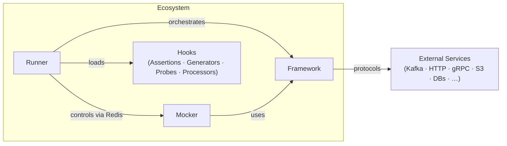

# QaaS Documentation

**Quality as a Service (QaaS)** is a .NET 10 ecosystem for integration and end-to-end testing of backend applications. Define tests in YAML, extend behaviour with C# hooks, and validate results — all with minimal boilerplate.

## Quick Navigation

-   :material-rocket-launch:{ .lg .middle } **Getting Started**

    ---

    Install the SDK, write your first test in YAML, run it, and read the Allure report — in under 10 minutes.

    [:octicons-arrow-right-24: Start Here](qaas/quickStart/installation.md)

-   :material-test-tube:{ .lg .middle } **Runner**

    ---

    The test orchestrator. Manages sessions, data sources, policies, storage, and assertions via YAML or code.

    [:octicons-arrow-right-24: Runner Docs](qaas/index.md)

-   :material-server:{ .lg .middle } **Mocker**

    ---

    Spin up HTTP, gRPC, or Socket mock servers with configurable stubs and runtime control via Redis.

    [:octicons-arrow-right-24: Mocker Docs](mocker/index.md)

-   :material-check-all:{ .lg .middle } **Hooks**

    ---

    Reusable assertions, data generators, environment probes, and transaction processors — plug them into any test.

    [:octicons-arrow-right-24: Hooks Reference](assertions/index.md)

-   :material-puzzle:{ .lg .middle } **Framework**

    ---

    The shared foundation: SDK types, 17-protocol abstraction layer, configuration engine, serialization, policies, and DI providers.

    [:octicons-arrow-right-24: Framework Docs](framework/index.md)

## Zero-to-Hero Path

| Step | What you'll do | Link |
|------|---------------|------|
| 1 | Install .NET 10 SDK and add the QaaS NuGet packages | [Installation](qaas/quickStart/installation.md) |
| 2 | Configure your IDE for YAML IntelliSense | [IDE Setup](qaas/quickStart/ide.md) |
| 3 | Write a minimal YAML test (sessions + assertions) | [Write a Test](qaas/quickStart/writeTestYaml.md) |
| 4 | Run the test and inspect the Allure report | [Run a Test](qaas/quickStart/runTest.md) |
| 5 | Create custom hooks (assertions, generators) | [Write Hooks](qaas/quickStart/writeHooks.md) |
| 6 | Extract config into reusable references | [Maintainable Tests](qaas/quickStart/makeTestMoreMaintainable.md) |
| 7 | Understand the architecture and advanced patterns | [Architecture](qaas/architecture.md) |
