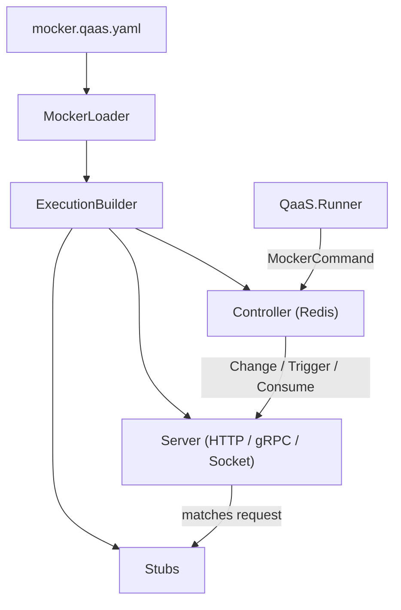

# QaaS Mocker

**QaaS.Mocker** is a lightweight mock-server framework for HTTP, gRPC, and raw TCP/UDP services. It is built on .NET 10, driven by YAML configuration, and designed for tight integration with [QaaS.Runner](../qaas/index.md) tests.

| | |
|---|---|
| **Runtime** | .NET 10 |
| **Package** | `QaaS.Mocker` (NuGet) |
| **Source** | [GitHub — QaaS.Mocker]({{ links.github_mocker }}) |
| **Docker** | Multi-stage Dockerfile included |

## Key Capabilities

- **HTTP server** — Kestrel-based, with per-endpoint route + method matching and configurable response stubs.
- **gRPC server** — reflection-based service binding; define stubs per service/method.
- **Socket server** — TCP and UDP with semaphore-controlled concurrency.
- **Runtime control** — a Redis pub/sub **Controller** lets the Runner (or any client) swap stubs, trigger actions, or consume cached transactions at runtime.
- **Plugin system** — extend with custom `IProcessor` / `ITransactionProcessor` implementations loaded from NuGet packages or local DLLs.
- **Stub management** — `TransactionStub` objects map request patterns to canned responses, including serialization format, delay, and status code.

## Architecture

1. **Load** — `MockerLoader` reads one or more YAML files, resolves placeholders, and builds the `Context`.
2. **Build** — `ExecutionBuilder` creates Stubs, Servers, and the Controller from config.
3. **Serve** — Servers listen for incoming requests, match them to stubs, execute any `ITransactionProcessor` hooks, and return the configured response.
4. **Control** — The Controller subscribes to a Redis channel. Runner sessions send `MockerCommand` actions (`Change`, `Trigger`, `Consume`) to swap stubs or retrieve cached data.

## CLI Modes

| Mode | Description |
|---|---|
| `run` | Start servers and controller (default) |
| `lint` | Validate configuration without starting servers |
| `template` | Print a YAML configuration template |

## Quick Start

1. [Installation](quickStart/installation.md)
2. [Create a Mock](quickStart/createMock.md)
3. [Deploy a Mock](quickStart/deployMock.md)
4. [Integrate with Runner Tests](quickStart/integrateWithTests.md)
