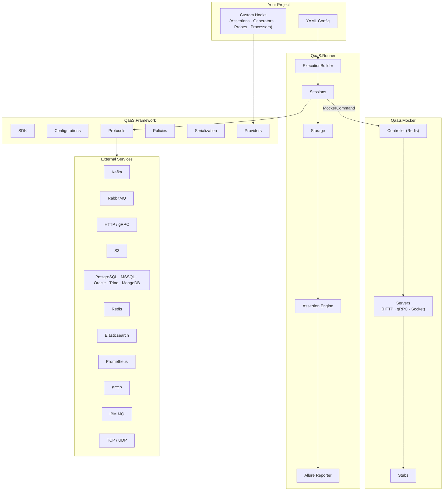
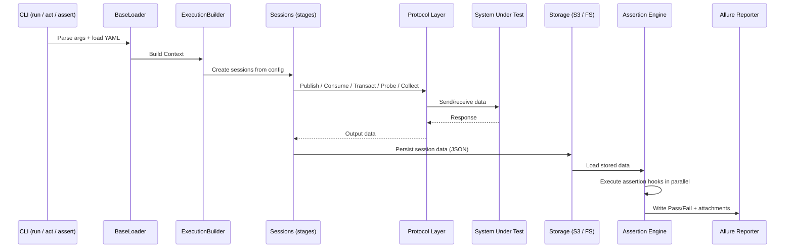
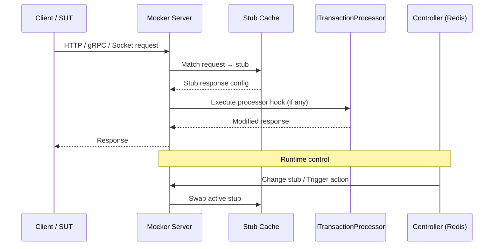

# Architecture

## System Overview

QaaS is composed of independently deployable components that share a common [Framework](../framework/index.md) layer.

## Data Flow

### Runner Execution Pipeline

### Mocker Request Flow

## Core Concepts

### Sessions

A session is a named communication workflow that executes in **stages**. Each stage contains one or more **actions** that run with configurable sleep intervals and policies.

| Action Type | Direction | Protocol Examples |
|---|---|---|
| **Publisher** | Send only | Kafka, RabbitMQ, HTTP, S3, Redis, SFTP, IBM MQ |
| **Consumer** | Receive only | Kafka, RabbitMQ, Redis, Socket, Elasticsearch |
| **Transaction** | Request → Response | HTTP, gRPC |
| **Probe** | Side effect | Kubernetes ops, DB truncate, Redis flush, S3 cleanup |
| **Collector** | Fetch metrics | Prometheus |
| **MockerCommand** | Redis command | Change/Trigger/Consume on Mocker |

### Hooks (Plugin System)

QaaS is a **plugin system**. All business-specific logic is injected through hooks:

| Hook | Base Class | When It Runs |
|---|---|---|
| **Assertion** | `BaseAssertion<TConfig>` | After sessions complete; validates stored data |
| **Generator** | `BaseGenerator<TConfig>` | Before sessions; produces `DataSource` input data |
| **Probe** | `BaseProbe<TConfig>` | During sessions; performs environment setup/teardown |
| **Processor** | `IProcessor` / `ITransactionProcessor` | During Mocker request handling; transforms responses |

Hooks are discovered automatically via [Autofac]({{ links.autofac }}) from the project assembly and any referenced NuGet packages (see [Providers](../framework/projects/providers.md)).

### Policies

Policies wrap session actions to control execution timing:

| Policy | Purpose |
|---|---|
| `CountPolicy` | Stop after N iterations |
| `TimeoutPolicy` | Stop after a duration |
| `LoadBalancePolicy` | Send at a constant rate (messages/sec) |
| `AdvancedLoadBalancePolicy` | Multi-stage rate control |
| `IncreasingLoadBalancePolicy` | Ramp from min to max rate |

### Protocol Support

The [Protocols](../framework/projects/protocols.md) package provides a unified interface across 17 services:

| Category | Protocols |
|---|---|
| **Messaging** | Kafka, RabbitMQ, IBM MQ |
| **HTTP / RPC** | HTTP (REST), gRPC |
| **Databases** | PostgreSQL, MSSQL, Oracle, Trino, MongoDB |
| **Cache / KV** | Redis |
| **Search / Monitoring** | Elasticsearch, Prometheus |
| **File / Storage** | S3, SFTP, Socket (TCP/UDP) |

### Configuration Resolution

YAML configuration supports:

- **`${}` placeholders** — resolved from environment variables, CLI overrides, or other config keys; supports null-coalescing via `??`.
- **`<<` merge keys** — collapse/merge YAML mappings to reduce duplication.
- **References** — include external YAML files by keyword (`ReferenceConfig`), with path or HTTP resolution.
- **Priority order** — CLI args → environment variables → YAML file (last file wins for overlapping keys).

See [Configuration As Code](advancedConcepts/configurationAsCode.md) and [Configuration Resolution](userInterfaces/runner/configurationResolutionPriority.md) for details.

## Project Types

### Runner Project

A .NET 10 console project referencing the `QaaS.Runner` NuGet package.  Entry point is `Bootstrap.Run(args)`, which parses CLI arguments and orchestrates the execution pipeline.

Configurable sections: **MetaData**, **Links**, **DataSources**, **Sessions**, **Assertions**, **Storages**.

### Mocker Project

A .NET 10 console/Docker project referencing the `QaaS.Mocker` NuGet package.  Entry point is `Bootstrap.Run(args)`, which starts servers and the Redis controller.

Configurable sections: **DataSources**, **Stubs**, **Server**, **Controller**.
