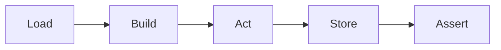

# QaaS Runner

**QaaS.Runner** is the test orchestrator of the QaaS ecosystem. It reads YAML (or code-based) configuration, executes multi-stage communication sessions against your backend services, stores results, runs assertions, and produces [Allure]({{ links.allure_docs }}) test reports.

|             |                                                   |
|-------------|---------------------------------------------------|
| **Runtime** | .NET 10                                           |
| **Package** | `QaaS.Runner` (NuGet)                             |
| **Source**  | [GitHub — QaaS.Runner]({{ links.github_runner }}) |

## How It Works

| Phase      | Description                                                                         |
|------------|-------------------------------------------------------------------------------------|
| **Load**   | Parses configuration, resolves placeholders, and merges overwriting files           |
| **Build**  | Constructs the execution plan — sessions, data sources, and assertion pipelines     |
| **Act**    | Runs sessions in stages, communicating with external services via protocol adapters |
| **Store**  | Persists all session data (inputs, outputs, timestamps, metadata)                   |
| **Assert** | Evaluates assertion hooks against stored data and produces the Allure report        |

## CLI Commands

| Command                                                  | Purpose                                        |
|----------------------------------------------------------|------------------------------------------------|
| [`run`](userInterfaces/runner/commands/run.md)           | Full cycle: act → store → assert               |
| [`act`](userInterfaces/runner/commands/act.md)           | Execute sessions and store data only           |
| [`assert`](userInterfaces/runner/commands/assert.md)     | Run assertions on previously stored data       |
| [`execute`](userInterfaces/runner/commands/execute.md)   | Run sequential commands from `executable.yaml` |
| [`template`](userInterfaces/runner/commands/template.md) | Output a YAML configuration template           |
