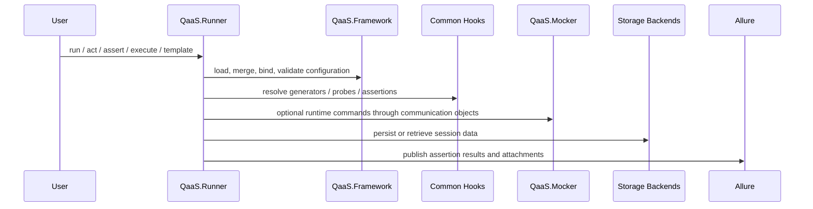

# Ecosystem Architecture

## Workspace Hierarchy

The workspace is a federation of sibling repositories. `qaas-docs` is the documentation host, not the runtime root.

| Directory | Purpose |
| --- | --- |
| `QaaS.Framework` | shared packages used everywhere else |
| `QaaS.Runner` | execution engine and CLI |
| `QaaS.Mocker` | configurable mock runtime |
| `QaaS.Common.Assertions` | assertion hook library |
| `QaaS.Common.Generators` | generator hook library |
| `QaaS.Common.Probes` | operational probe hook library |
| `QaaS.Common.Processors` | transaction processors for the mocker |
| `QaaS.Mocker.CommunicationObjects` | runner-mocker messaging contracts |
| `_ci_check_runner` | support copy used for CI-oriented workflows |
| `_external/QaaS.Framework` | vendored or reference copy of the framework |

## Data Flow

## Configuration Resolution Order

The runner and mocker both follow layered configuration patterns, but the runner is the richer case:

1. load the base YAML file,
2. apply overwrite files in argument order,
3. resolve case files unless `--resolve-cases-last` is set,
4. push referenced YAML fragments,
5. apply inline overwrite arguments,
6. optionally resolve environment variables.

That ordering matters because the runtime builders are validated after the merge is complete.

## Interdependency Summary

- `QaaS.Framework.SDK` defines the core abstractions used by generators, assertions, probes, processors, and communication contracts.
- `QaaS.Framework.Protocols` centralizes transport and storage adapters so the runner and mocker do not duplicate protocol clients.
- `QaaS.Runner` consumes common generators, assertions, and probes as dynamically loaded hooks.
- `QaaS.Mocker` consumes processors as dynamically selected transaction logic.
- `QaaS.Mocker.CommunicationObjects` keeps runner-driven mocker commands versioned independently from the runtime implementations.

## Contribution Path

Choose the repository by the change you need:

- change YAML loading, serialization, policy, or protocol behavior: `QaaS.Framework`
- change test execution flow or CLI behavior: `QaaS.Runner`
- add a new assertion, generator, or probe: the matching `QaaS.Common.*` package
- add or change mock response logic: `QaaS.Common.Processors`
- add or change mock hosting/runtime control: `QaaS.Mocker`
