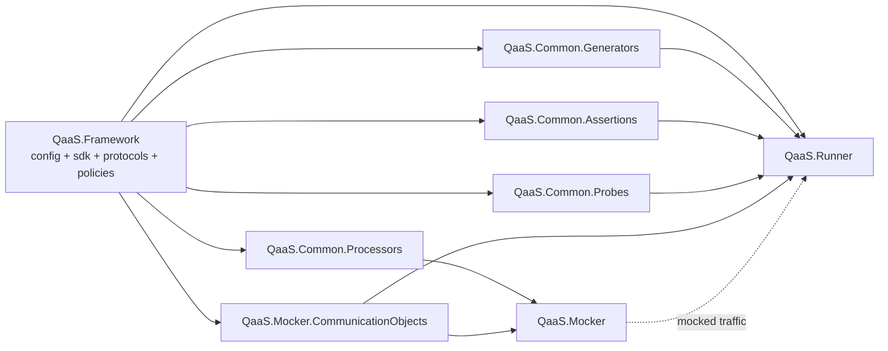

## QaaS Zero-to-Hero

### Overview

QaaS is not a single executable. It is a workspace of cooperating .NET repositories:

- [`QaaS.Framework`](https://github.com/TheSmokeTeam/QaaS.Framework) provides the reusable contracts, protocol adapters, policy engine, serialization, and configuration loader.
- [`QaaS.Runner`](https://github.com/TheSmokeTeam/QaaS.Runner) turns YAML configuration into runnable test executions, session flows, assertions, storage writes, and reports.
- [`QaaS.Mocker`](https://github.com/TheSmokeTeam/QaaS.Mocker) hosts configurable HTTP, gRPC, and socket mocks.
- [`QaaS.Common.Assertions`](https://github.com/TheSmokeTeam/QaaS.Common.Assertions), [`QaaS.Common.Generators`](https://github.com/TheSmokeTeam/QaaS.Common.Generators), [`QaaS.Common.Probes`](https://github.com/TheSmokeTeam/QaaS.Common.Probes), and [`QaaS.Common.Processors`](https://github.com/eldarush/QaaS.Common.Processors) provide pluggable hooks.
- [`QaaS.Mocker.CommunicationObjects`](https://github.com/TheSmokeTeam/Qaas.Mocker.CommunicationObjects) defines the shared contracts used when the runner controls the mocker at runtime.

`QaaS.Runner` is the operational center of the ecosystem. It loads configuration, resolves generators and hooks, executes sessions, optionally persists intermediate session data, and evaluates assertions.

### Architecture & Connections



The normal execution path is:

1. The runner loads one or more YAML files and applies overwrite files, inline overwrite arguments, optional pushed references, case variants, and environment variables.
2. `QaaS.Framework.Configurations` binds the final merged configuration into typed builders.
3. The runner resolves generator, assertion, and probe hooks through `QaaS.Framework.Providers` and Autofac.
4. Sessions execute publishers, transactions, consumers, probes, collectors, and optional mocker commands in staged order.
5. Session data is either kept in memory, persisted through configured storages, or both.
6. Assertions consume session data plus referenced data sources and publish report artifacts through Allure.

### Quick Start

Use this path when you have just cloned the workspace and need a first successful end-to-end run.

1. Restore and build the core repositories:

   ```bash
   dotnet restore D:/QaaS/QaaS.Framework/QaaS.Framework.sln
   dotnet restore D:/QaaS/QaaS.Runner/QaaS.Runner.sln
   dotnet restore D:/QaaS/QaaS.Mocker/QaaS.Mocker.sln
   dotnet build D:/QaaS/QaaS.Framework/QaaS.Framework.sln -c Release --no-restore
   dotnet build D:/QaaS/QaaS.Runner/QaaS.Runner.sln -c Release --no-restore
   dotnet build D:/QaaS/QaaS.Mocker/QaaS.Mocker.sln -c Release --no-restore
   ```

2. Start with the mocker examples in [`QaaS.Mocker.Example`](https://github.com/TheSmokeTeam/QaaS.Mocker/tree/master/QaaS.Mocker.Example) if you need a controllable dependency.
3. Run a runner command against a checked-in sample:

   ```bash
   dotnet test D:/QaaS/QaaS.Runner/QaaS.Runner.E2ETests/QaaS.Runner.E2ETests.csproj
   ```

4. Move from samples to contribution work:
   - add or change a hook in one of the `QaaS.Common.*` repositories,
   - wire it into a runner or mocker configuration,
   - verify the behavior in the relevant test project,
   - update the corresponding docs package in this repository.

### Technical Reference

#### Workspace Map

| Repository | Role | Depends on |
| --- | --- | --- |
| `QaaS.Framework` | Shared runtime foundation | none |
| `QaaS.Runner` | CLI execution engine and report pipeline | `QaaS.Framework`, `QaaS.Mocker.CommunicationObjects` |
| `QaaS.Mocker` | Protocol mock runtime and controller | `QaaS.Framework.Executions`, `QaaS.Common.Processors`, `QaaS.Mocker.CommunicationObjects` |
| `QaaS.Common.Assertions` | Assertion hook implementations | `QaaS.Framework.Executions` |
| `QaaS.Common.Generators` | Generator hook implementations | `QaaS.Framework.Executions` |
| `QaaS.Common.Probes` | Probe hook implementations | `QaaS.Framework.Executions` |
| `QaaS.Common.Processors` | Mocker transaction processors | `QaaS.Framework.Executions` |
| `QaaS.Mocker.CommunicationObjects` | Shared runner-mocker contracts | `QaaS.Framework.SDK` |

#### Onboarding Order

If you are new to the codebase, read and use the repositories in this order:

1. `QaaS.Framework`
2. `QaaS.Runner`
3. `QaaS.Common.Generators` and `QaaS.Common.Assertions`
4. `QaaS.Mocker`
5. `QaaS.Common.Probes`, `QaaS.Common.Processors`, and `QaaS.Mocker.CommunicationObjects`

That order matches the runtime dependency graph and minimizes context switching.

#### Dependency Notes

The ecosystem relies on a small set of recurring infrastructure libraries:

- [.NET configuration abstractions](https://learn.microsoft.com/en-us/dotnet/core/extensions/configuration) for layered configuration loading and binding.
- [Autofac](https://docs.autofac.org/en/latest/) for hook discovery and runtime container wiring.
- [Serilog](https://github.com/serilog/serilog/wiki) for structured logging.
- [YamlDotNet](https://github.com/aaubry/YamlDotNet) for YAML parsing and emission.
- [AWS SDK for .NET](https://docs.aws.amazon.com/sdk-for-net/v4/developer-guide/welcome.html), [StackExchange.Redis](https://stackexchange.github.io/StackExchange.Redis/), and protocol-specific client libraries through `QaaS.Framework.Protocols`.

### Troubleshooting & Links

- If a runner configuration stops binding cleanly, inspect the builder type descriptions in the source before trusting older prose. The code is the source of truth.
- If a hook name resolves at runtime but the implementation is not found, verify the package reference and the configured hook name match the builder `Display`/hook type names exactly.
- `_ci_check_runner` and `_external/QaaS.Framework` are support directories in this workspace, not primary documentation targets.

Primary links:

- Docs repository: [TheSmokeTeam/qaas-docs](https://github.com/TheSmokeTeam/qaas-docs)
- Runner source: [TheSmokeTeam/QaaS.Runner](https://github.com/TheSmokeTeam/QaaS.Runner)
- Framework source: [TheSmokeTeam/QaaS.Framework](https://github.com/TheSmokeTeam/QaaS.Framework)
- Mocker source: [TheSmokeTeam/QaaS.Mocker](https://github.com/TheSmokeTeam/QaaS.Mocker)
