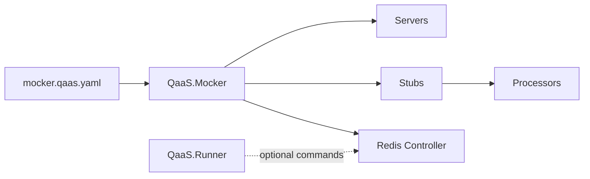

## QaaS.Mocker Zero-to-Hero

### Overview

[`QaaS.Mocker`](https://github.com/TheSmokeTeam/QaaS.Mocker) is the configurable mock runtime in the QaaS ecosystem. It turns YAML configuration into protocol servers, transaction stubs, and an optional Redis-backed runtime controller so tests can steer mock behavior while they run.

Internal project split:

| Project | Role |
| --- | --- |
| `QaaS.Mocker` | command-line entrypoint and configuration loader |
| `QaaS.Mocker.Stubs` | maps incoming actions to processor-backed transaction stubs |
| `QaaS.Mocker.Servers` | hosts HTTP, gRPC, and socket runtimes |
| `QaaS.Mocker.Controller` | optional Redis command/ping controller |
| `QaaS.Mocker.Example` | runnable sample configs and Helm chart assets |

### Architecture & Connections

`QaaS.Mocker` depends on:

- `QaaS.Framework.Executions` for execution scaffolding and logger options,
- `QaaS.Common.Processors` for reusable transaction logic,
- `QaaS.Mocker.CommunicationObjects` for controller request and response contracts.



### Quick Start

Build the solution:

```bash
dotnet restore D:/QaaS/QaaS.Mocker/QaaS.Mocker.sln
dotnet build D:/QaaS/QaaS.Mocker/QaaS.Mocker.sln -c Release --no-restore
dotnet test D:/QaaS/QaaS.Mocker/QaaS.Mocker.sln -c Release --no-build
```

Run the shipped HTTP example:

```bash
dotnet run --project D:/QaaS/QaaS.Mocker/QaaS.Mocker -- D:/QaaS/QaaS.Mocker/QaaS.Mocker.Example/mocker.qaas.yaml
```

Run the shipped gRPC example:

```bash
dotnet run --project D:/QaaS/QaaS.Mocker/QaaS.Mocker -- D:/QaaS/QaaS.Mocker/QaaS.Mocker.Example/mocker.grpc.qaas.yaml
```

### Technical Reference

#### CLI Surface

`MockerOptions` supports:

| Option | Meaning |
| --- | --- |
| positional `ConfigurationFile` | path to `mocker.qaas.yaml` |
| `-m, --mode` | `Run`, `Lint`, or `Template` |
| `-w, --overwrite-files` | ordered overwrite files |
| `-r, --overwrite-arguments` | inline overrides |
| `--no-env` | disables environment overrides |
| `-o, --output-folder` | output directory for generated templates |
| `--run-locally` | keeps the process interactive for local runs |

#### Root YAML Sections

| Section | Purpose |
| --- | --- |
| `DataSources` | reusable generator-backed inputs for stubs |
| `Stubs` | named transaction stub definitions |
| `Server` | exactly one server family: HTTP, gRPC, or socket |
| `Controller` | optional Redis-backed runtime control plane |

#### Key Dependency Notes

- [CommandLineParser](https://github.com/commandlineparser/commandline) drives CLI parsing.
- [Autofac](https://docs.autofac.org/en/latest/) wires processors and runtime services.
- [StackExchange.Redis](https://stackexchange.github.io/StackExchange.Redis/) powers the controller channel.
- [gRPC for C#](https://grpc.io/docs/languages/csharp/) underpins the gRPC server path.

### Troubleshooting & Links

- If the mocker starts but returns no response, check the action-to-stub mapping first. The server config can be valid while the stub name is wrong.
- If runner-issued mocker commands do nothing, make sure both sides use the same Redis settings and compatible communication-object package versions.
- The example project is the fastest way to verify whether a failure is in the runtime or in your configuration.

Primary links:

- Source: [TheSmokeTeam/QaaS.Mocker](https://github.com/TheSmokeTeam/QaaS.Mocker)
- NuGet package: [QaaS.Mocker](https://www.nuget.org/packages/QaaS.Mocker/)
