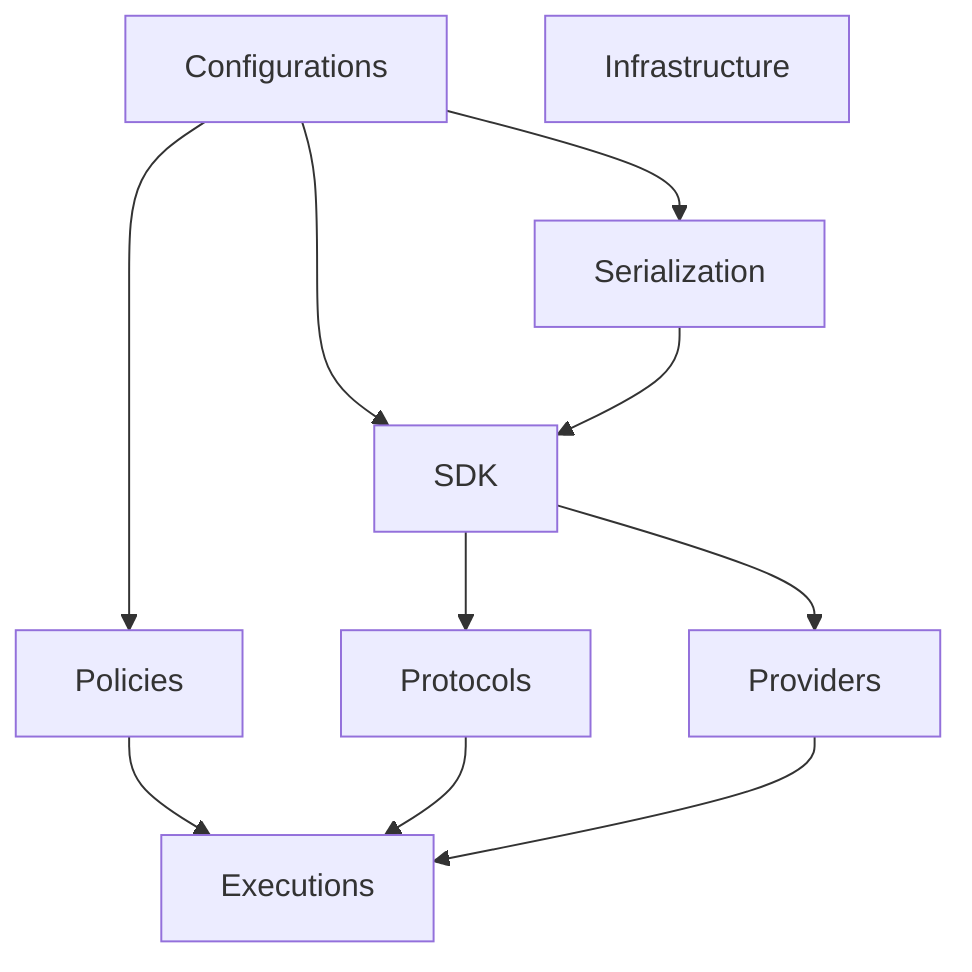

## QaaS.Framework Zero-to-Hero

### Overview

[`QaaS.Framework`](https://github.com/TheSmokeTeam/QaaS.Framework) is the foundation layer for the whole workspace. It is split into focused NuGet packages so the runner, mocker, and hook libraries can reuse the same configuration, protocol, serialization, and hook contracts without duplicating infrastructure code.

Package map:

| Package | Responsibility |
| --- | --- |
| `Configurations` | layered YAML/config binding, placeholders, references, validation |
| `Executions` | reusable execution base types, CLI plumbing, logger options |
| `Infrastructure` | small shared utilities |
| `Policies` | rate, timeout, count, and load-balancing controls |
| `Protocols` | HTTP, gRPC, queue, database, object-store, socket, and monitoring adapters |
| `Providers` | runtime hook discovery and Autofac module wiring |
| `SDK` | shared contracts, context models, data-source builders, session data models |
| `Serialization` | serializer/deserializer factories and type hints |

### Architecture & Connections

`QaaS.Framework` sits below every other publishable repository in the workspace.



Upstream consumers:

- `QaaS.Runner` uses `Executions`, `SDK`, `Protocols`, `Providers`, and `Configurations`.
- `QaaS.Mocker` uses `Executions` and `SDK`, while its processors rely on the same abstractions.
- `QaaS.Common.*` packages implement hooks against `SDK` plus the needed protocol and serialization pieces.

### Quick Start

Build the framework solution locally:

```bash
dotnet restore D:/QaaS/QaaS.Framework/QaaS.Framework.sln
dotnet build D:/QaaS/QaaS.Framework/QaaS.Framework.sln -c Release --no-restore
dotnet test D:/QaaS/QaaS.Framework/QaaS.Framework.sln -c Release --no-build
```

Consume the minimum useful packages in another project:

```bash
dotnet add package QaaS.Framework.SDK
dotnet add package QaaS.Framework.Protocols
dotnet add package QaaS.Framework.Executions
```

Choose packages by behavior, not by habit. If you only need hook contracts, start with `QaaS.Framework.SDK` and add more packages only when a runtime concern actually appears.

### Technical Reference

#### Configuration Loading

`QaaS.Framework.Configurations` owns:

- YAML loading from filesystem and HTTP GET sources,
- placeholder resolution,
- reference expansion from external YAML fragments,
- recursive validation through DataAnnotations plus custom validators.

Shared config types exposed from this package:

| Type | Purpose |
| --- | --- |
| `FilesInFileSystemConfig` | directory-backed storage configuration |
| `S3BucketConfig` | bucket and prefix storage configuration |
| `MongoCollectionConfig` | MongoDB collection identification |
| `ReferenceConfig` | pushed-root reference list configuration |

#### Runtime Contracts

The `SDK` package defines the stable object model used everywhere else:

- `Context`, `InternalContext`, and metadata helpers,
- `DataSourceBuilder` plus runtime `DataSource`,
- execution metadata such as `ExecutionType`,
- hook contracts such as `IGenerator`, `IAssertion`, `IProbe`, and processor abstractions.

#### Dependency Notes

Important dependencies and their official docs:

- [.NET configuration](https://learn.microsoft.com/en-us/dotnet/core/extensions/configuration)
- [Autofac](https://docs.autofac.org/en/latest/)
- [YamlDotNet](https://github.com/aaubry/YamlDotNet)
- [RabbitMQ .NET client](https://www.rabbitmq.com/client-libraries/dotnet-api-guide)
- [AWS SDK for .NET](https://docs.aws.amazon.com/sdk-for-net/v4/developer-guide/welcome.html)
- [StackExchange.Redis](https://stackexchange.github.io/StackExchange.Redis/)
- [Confluent Kafka .NET client](https://docs.confluent.io/kafka-clients/dotnet/current/overview.html)

### Troubleshooting & Links

- Prefer the smallest framework package that solves the problem. Pulling in `Executions` or `Protocols` when you only need `SDK` makes extension packages harder to reason about.
- When validation errors look unrelated, check custom attributes in `QaaS.Framework.Configurations.CustomValidationAttributes`; many constraints are cross-field, not local.
- When a protocol config appears valid but fails at runtime, compare the chosen config type with the factory used in `FetcherFactory`, `ReaderFactory`, `SenderFactory`, or `TransactorFactory`.

Primary links:

- Source: [TheSmokeTeam/QaaS.Framework](https://github.com/TheSmokeTeam/QaaS.Framework)
- NuGet search: [QaaS.Framework packages](https://www.nuget.org/packages?q=QaaS.Framework)
